# <Narth-Vaders-Question-Raiders>

# Narth Vaders Question Raiders | Star Wars Edition

Narth Vaders Question Raiders | Star Wars Edition is an online quiz game built to test the knowledge of star wars fans.

Anybody can access it and play the quiz game to test themselves. This can be done via desktop, tablet or mobile as the game is responsive. 

All users will go throught 10 random questions picked from and object array of 21 questions and recieve a score out of 10 at the end with a message depending on what the user scored.

 
[View Narth Vaders Question Raiders | Star Wars Edition project here](https://github.com/DarthKoder/Star-Wars-Question-Raider)
- - -
## Table of Contents
### [User Experience (UX)](#user-experience-ux-1)
* [Rationale](#rationale-1)
* [User Stories](#user-stories)
### [Features](#features)
* [Existing Features](#existing-features)
### [Features Left to Implement](#features-left-to-implement-1)
### [Design](#design-1)
### [Technologies Used](#technologies-used-1)
### [Frameworks, Libraries & Programs Used](#frameworks-libraries--programs-used-1)
### [Testing](#testing-1)
* [Validation Results](#validation-results)
* [Manual Testing](#manual-testing)
* [Lighthouse Report](#lighthouse-report)
### [Deployment and local development](#deployment-and-local-development-1)
* [GitHub Pages](#github-pages)
* [Forking the GitHub Repository](#forking-the-github-repository)
* [Local Clone](#local-clone)
### [Credits](#credits-1)
### [Acknowledgements](#acknowledgements-1)
---
## Rationale

## User Experience (UX)

### Rationale

This website is designed to provide users enjoyment whilst seamlessly testing their Star Wars knowledge using a fun 10 question quiz game to do so.

The aim is to cater to all fans of the genre, whether they are die hard fans or just dabbling in it. The game is here to not only test, but help people learn more about Star Wars and is also intuitive and informative at the same time.

There is clear and simple intuitive buttons as guidance to help the user along their way, such as a "Begin The Trials" start button, multiple choice questions to pick from and also "Next" & "Finish" buttons for the game. The results modal has the "Close" & "Play Again" buttons also. 

The user must input their name to begn the game which is then used in the result screen to create a more personal experience.

To help inspire the user and bring them into the Star Wars universe for their experience, I have used familiar colours and fonts as well as an animated space background to help make the user feel immersed and really connect with the Star Wars theme. 

### User Stories

 * First-time visitor goals
    * Have fun when playing the game.
    * Bring pleasure to the user with familiar Star Wars immersion.
    * Easily navigate throughout the site.
    * Be able to complete the game with intuitive design.
    
 * Returning visitor goals
    * Be able to have variety with questions asked.
    * Have the opportunity to get better scores and see the different messages that are displayed for their improvement.
    * Enjoy the familiar aesthetic.

 * Frequent user goals
    * Always being able to navigate their way.
    * Have the opportunity to get better scores and see the different messages that are displayed for their improvement.
    * Enjoy the familiar aesthetic.
    * Review the questions and any added questions to the random question index.
    * Review any changes.
    
- - -

## Features

* This website is targeting people who interested in Star Wars.
* The user can enjoy the Star Wars aesthetic whist testing their knowledge with a 10 question quiz game.
* They can use the intuitive design to navigate through the game with ease, whether on a mobile, tablet or desktop computer.
* It has responsive logic to higlight correct and incorrect questions to help the user know if they are correct or to learn where they went wrong.

### Existing Features

* Game Title
    * This is the game title and series edition to show what the game is about and can be seen as constant throught the game and series (if any future game editions are to be made).
    * I have used the famous Star Wars colours for this such as the Star Wars yellow #ffbf50 & sith red #a80000, which is also the logos/series main colour.

    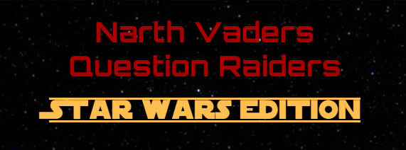

* Starting Screen
    * It is the opening screen to the game.
    * This has the game title and series edition to show what the game is about (this is the same throughout all screens).
    * It uses familliar fonts such as the "Star Wars" font and then "Orbitron", "Teko" & "Jersey 10" to give it more of a Star Wars feel and space like immersion.
    * This has a name input fiel with a min/max charcter requirement that must be filled out in able to start the game.
    * The name input will be called in the results screen to bring a personalised experience for the user.
    * It contains a reactive button to allow easy navigation to start the game, with an enticing prompt of "Begin The Trials", which is to be clicked to start the game. This button also has a hover effect to let the user know the button can be activated.
    * I have used colours associated with Star Wars such as sith red #a80000, the famous Star Wars yellow #ffbf50, Jedi green, Jedi blue #2b5a99 along with a contrasting pale, light #fafafa, all on the space style black #000000. These colours are to help make the user feel immersed and really connect with the Star Wars theme. 

    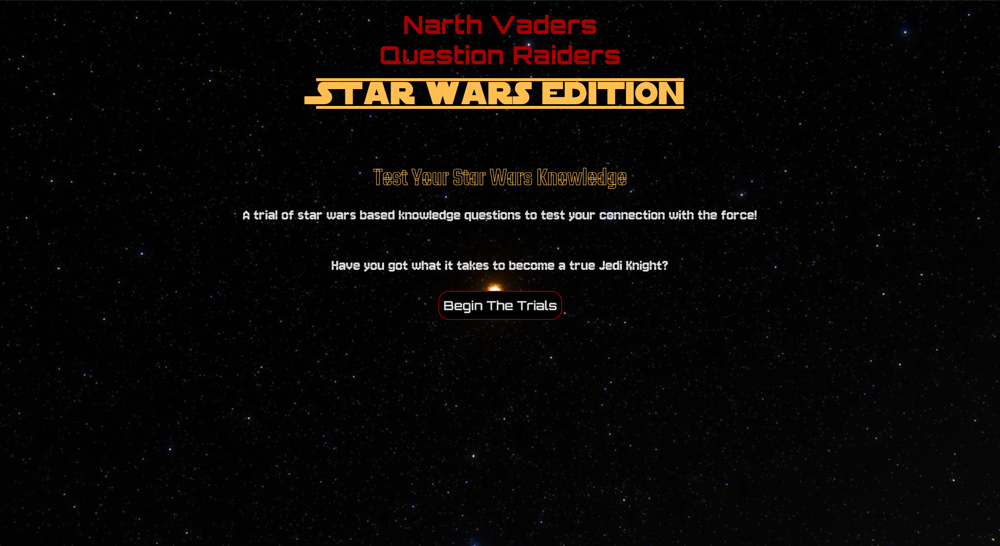

* Question Screen 
    * The Question Screen is the screen that come after clicking the "Begin The Trials" start button.
    * It has the game title along with the series edition.
    * This is where the question and multiple choice questions will appear for the user to see and pick from.

    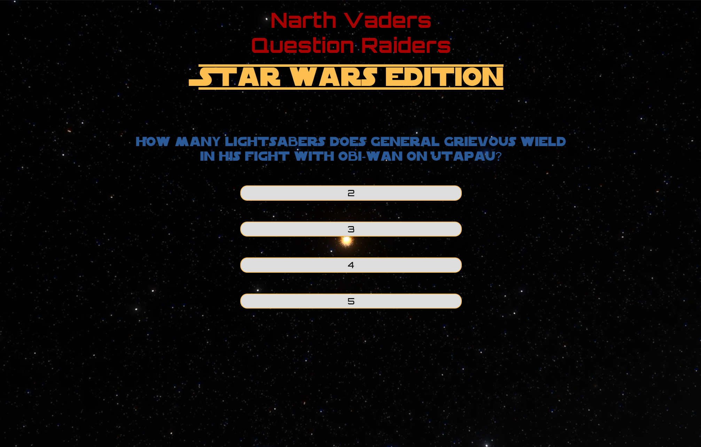

    * The questions that appear will be randomised and shall not repeat any question in one game. 
    * Depending on the users answer/input, the question choice clicked will highlight green if correct and red if incorrect. If incorrect the correct answer will also highlight green to help the user understand where they went wrong. 
    * Once an answer/input has been given, the question buttons will be disabled to stop the user from changing their answers.
    * The question is using the "Star Wars" font in the Jedi blue colour.
    * The multiple choice questions each appear in an oblong box with a white background with black "Orbitron" font and a Star Wars yellow border.
    * The question buttons are also reactive and the background turns yellow when hovered over.

    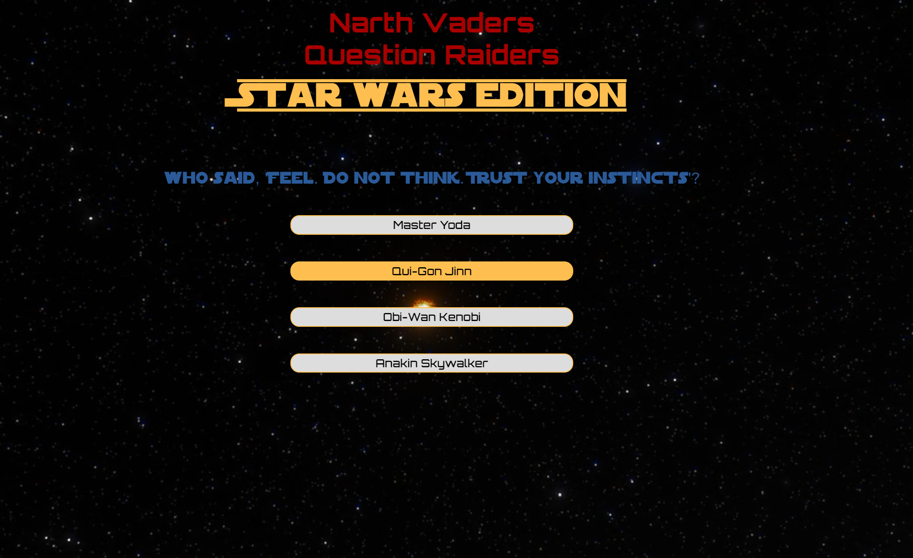

    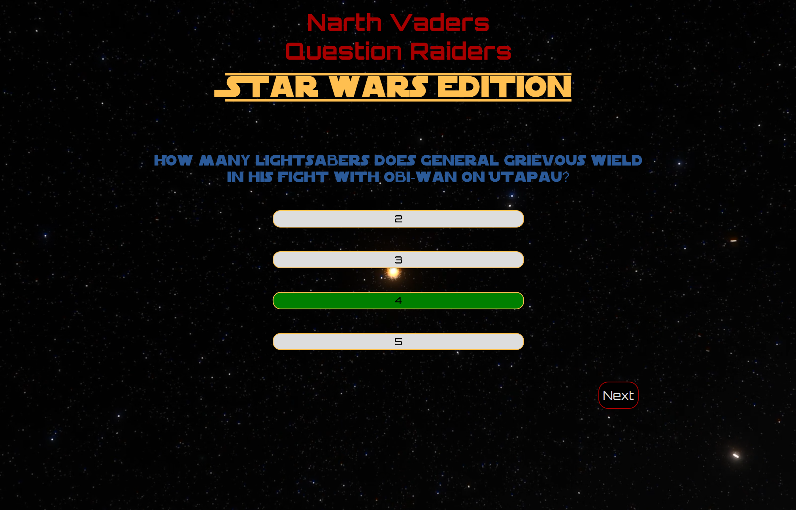

    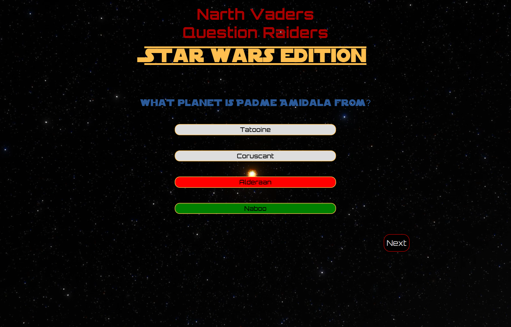

    * If the question number is below 10, the answer/input has been given and the answer has been checked and highlighted correct or incorrect, a "Next" button will appear to move forward to the next question.
    * If the question number is at 10, the answer/input has been given and the answer has been checked and highlighted correct or incorrect, a "Finish" button will appear to end the game and bring up the results modal.
    * These buttons will also be reactive and change the background colour when hovered over.

    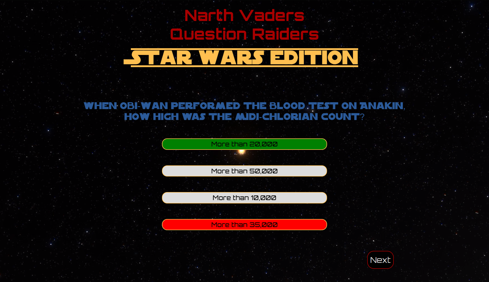

    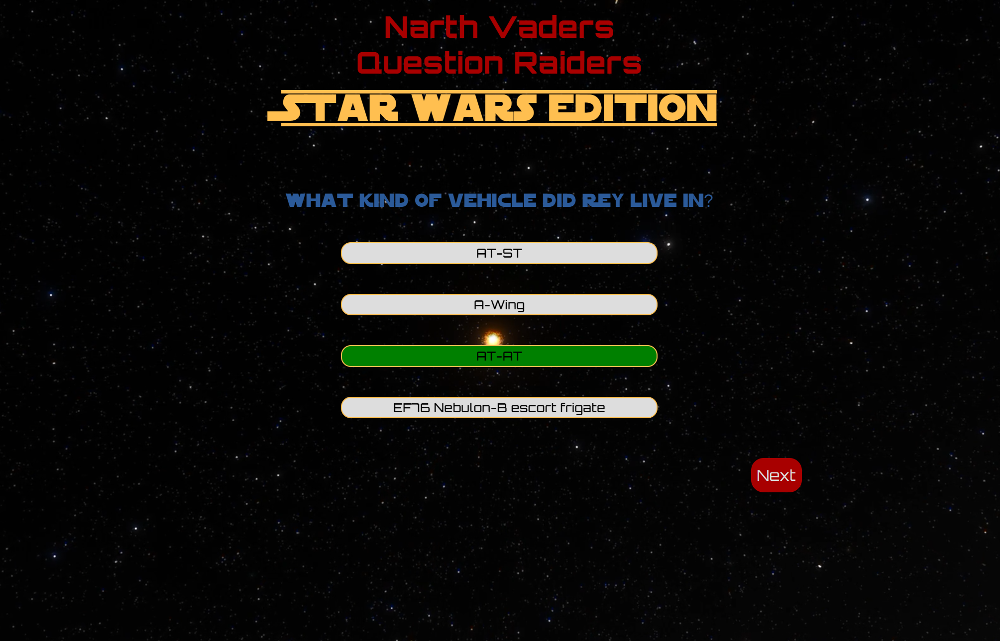

    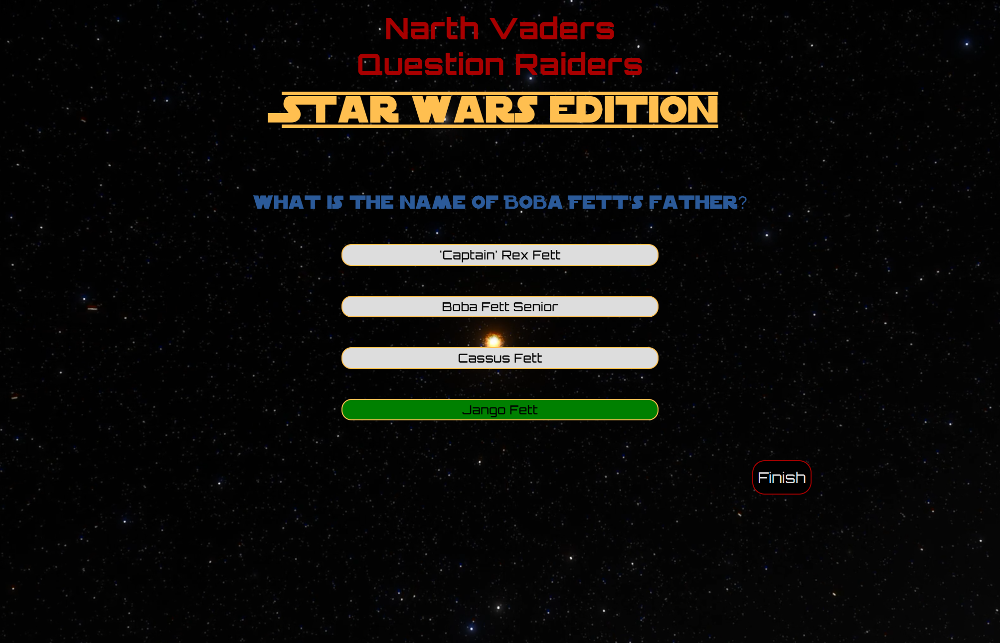

    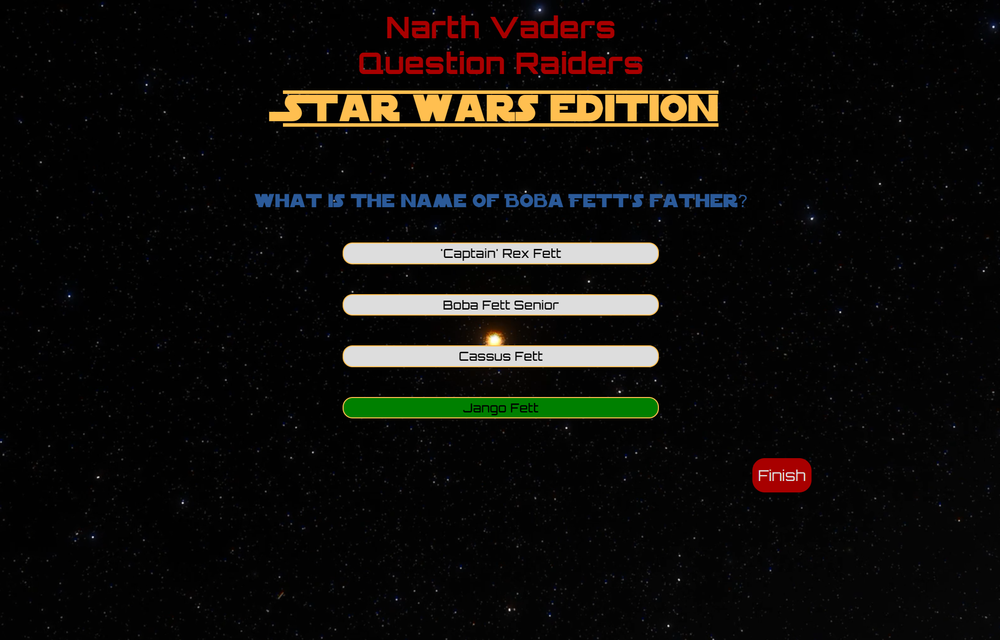

* Results Screen
    * The results screen is a pop up modal that appears after the user has completed 10 questions and then presses the "Finish" button. 
    * I have used the "Orbitron" font for this, which is consistant with the theme and the rest of the game. 
    * This is a modal pop up box that has a title section, body section and a footer section. 
    * The title section has a the title "Completed The Questions, You Have!" to let the user know they have completed taking the quiz. 
       - This has a black background with the yellow font #ffbf50. 
    * The modals body section contains the score results for the user, a message that changes depending on the score you have (there are 3 variables) and then some text asking the user if they would like to play again. 
       - This has a light #fafafa background 
       - The results score text is large and red #a80000 to stand out
       - The message text is black of colour
       - The "Would you like to play again?" text is in jedi green.
       - I have made these different colours to stand out and make it clear that they are different sections of the body.
    * The footer contains two buttons, one to close the modal and the other to play again and take the user back to the starting screen. 
       - Both buttons have the original button layout with black background and white text with a red border.
       - The close button when hovered over has the background turn red like the other buttons in the game.
       The play again button when hovered over, turns green to help signify the green light to play again. 
    * The results modal is designed to give a rewarding feel with a personal message to the player and also give the determionation to get better.
    * It is intuitive and informative at the same time.

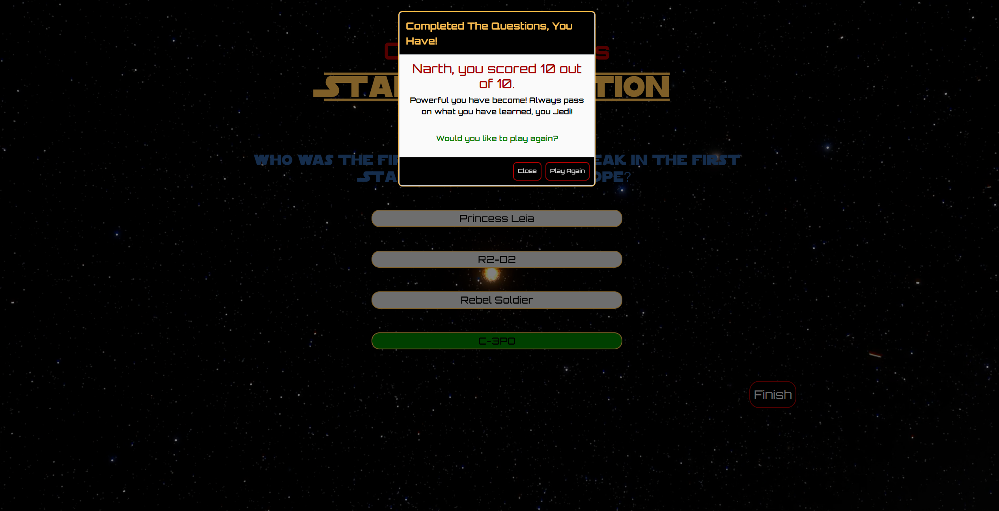

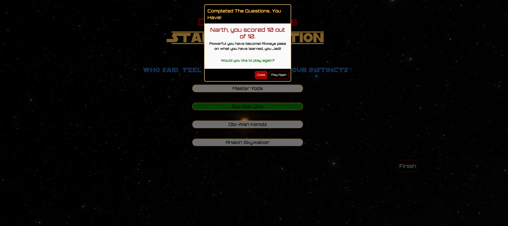

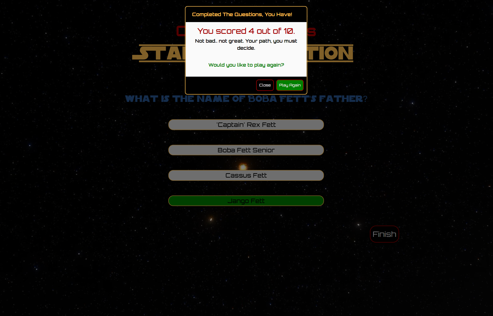

---

## Features Left to Implement

* Too add more questions for more variety to the quiz and returning users.
* I could add a hints button which, when pressed, gave the user a hint to the answer of that question. 
* Changing colour schemes for the results box depending on the users score. 
* Adding special options such as 50 / 50 but a limited amount that may be earned throught the game if the game was extended. 

## Design

 * Colour Scheme
    * Primary colours used on the website: 

 * Typography
    * 'Orbitron' font is the main font used throughout the site with the addition of "Star Wars", "Teko" & "Jersery 10" for certain aspects. These all have sans-serif as its fallback font, in case the imported fonts dont load for any reason.
    * The main logo uses the 'Orbitron' font while the edition for this particular edition is the "Star Wars" font, this will change with other editions to match the theme.
    * "Teko" & "Jersey 10" have been used in the starting screen for the H2 and paragraphs respectively. 

 * Wireframes
    * Figma: Easy to create, uses and shares detailed images whilst also effective.
    * Please find my wireframes here: [Figma: Star Wars Quiz Game](https://www.figma.com/design/eaYZirqx29lepICWkza2ik/SW-Quiz--Game?node-id=0%3A1&t=2xEmSDLvmOgxVaHC-1)
---

## Bug fixes 

* One issue I came across was that the "Next" button was not working when pressed. 
   - After rigorous testing and trial and error, I realised that I have the button disabled and had to enable it by editing code and moving the diplayNextQuestion function to the top. 

* Another bug I had was that, while testing, I found that when I was going through the questions and it was surpassing the 10 question limit and had not end. 
   - This was due having the code wrong for hiding the "Next" button and displaying the "Finish" button, which in turn,  never made it possible to end the game and bring up the results screen. 

* The biggest issue I had after testing the game cycle and finish button appearing, was that the game was only displaying 4 questions before initializing the "Finish" button. 
   -	After console logging number of questions generated in the displayNextQuestion function, I have found that the start button was generating 2 questions(in the console log) then each time the next button was clicked it would generate another 2, then 4 etc . 
   -	I searched through the code and after rigorous testing, figured out where I had gone wrong. 
   -	I had "};" in the wrong place and had:
   "disableAnswerButtons()"
   "enableAnswerButtons()"
   "checkAnswer()" functions 
   and the code for: 
   next button 
   "Finish" button & "displayResults" all in the "displayNextQuestion()" function, which was called upon when the next button was clicked hence why it was displaying more and more questions once the game had started. 
   -	I still at this point had the start button causing 2 questions to be generated before the game had actually started
   -	After going through the code I realised that because I had the "displayNextQuestion()" function being called within the "startGame()" function and the "startGame()" function was called when the start button was clicked. This meant that the "displayNextQuestion" function was being called twice, once when the start button was clicked and again when the "startGame()" function was running.  

* I encountered a bug where the "Next" button was showing after question 10 which then needs to be pressed for the finish button to appear. 
   - This was overcome by changing the code from: 
      - if (usedQuestions.length <= 10) {
                document.getElementById("next-btn").style.display = "block";
            } else {
                document.getElementById("next-btn").style.display = "none";
                document.getElementById("finish-btn").style.display = "block";
            }
        });
   - To:
      - if (usedQuestions.length <= 9) {
                document.getElementById("next-btn").style.display = "block";
            } else {
                document.getElementById("next-btn").style.display = "none";
                document.getElementById("finish-btn").style.display = "block";
            }
        });
   - This way, the "Next" button would not appear on the 10th question, only the "Finish" button.

---

## Technologies Used

 * [HTML5](https://en.wikipedia.org/wiki/HTML5)
 * [CSS3](https://en.wikipedia.org/wiki/CSS) 
 * [JavaScript](https://en.wikipedia.org/wiki/JavaScript)
---

## Frameworks, Libraries & Programs Used

 * [Visual Studio Code](https://visualstudio.microsoft.com/)
    * Desktop version to write and edit the code. 
 * [Github](https://github.com/)
    * Deployment of the website and storing the files online.
    * Version control.
 * [Google Fonts](https://fonts.google.com/)
    * Import main fonts the website.
* [Bootstrap v5.3](https://getbootstrap.com/)
    * Used for its helpful responsive layouts and components such as the results modal.

---

## Testing

The W3C Markup Validator and W3C CSS Validator services were used to validate every page of the project, to ensure there were no errors.

 * [W3C Markup Validtor](https://validator.w3.org/)
 * [W3C CSS Validator](https://jigsaw.w3.org/css-validator/)
 * [JS Lint](https://www.jslint.com/)
 * [JS Hint](https://www.jshint.com/)

### Validation results

index.html

style.css

style.css

### Manual Testing

* The website was tested on Google Chrome & Microsoft Edge.
* The website was viewed on a desktop computer and Moto G Power mobile phone.
* A large amount of manual testing was done to ensure all buttons are working correctly.
* A large amount of manual testing was done to ensure that the logic behind the game worked and the user experience is fulfilled.
* A large amount of manual testing was done to ensure that there were no bugs hindering the game and any progression.
* Family and friends were asked to review the website for a better understanding of the user experience.
* Dev Tools was used to test how the site looks on various screen sizes.
* Dev Tools Lighthouse was use to test the performance accessibility, best prectices and SEO of each page.
* JS Lint was used to ensure there are no major issues with the script.

### Lighthouse Report

#### Desktop analysis

Home Page

Home Page

#### Mobile analysis

Home Page

Home Page

---

## Deployment and local development

### GitHub Pages

GitHub Pages used to deploy live version of the website.
1. Log in to GitHub and locate [GitHub Repository Hunter Kitchen Design](https://github.com/DarthKoder/Star-Wars-Question-Raider)
2. At the top of the Repository(not the main navigation) locate "Settings" button on the menu.
3. Scroll down the Settings page until you locate "GitHub Pages".
4. Under "Source", click the dropdown menu "None" and select "Main" and click "Save".
5. The page will automatically refresh.
6. Scroll back to locate the now-published site [link](https://github.com/DarthKoder/Star-Wars-Question-Raider) in the "GitHub Pages" section.

### Forking the GitHub Repository

By forking the repository, we make a copy of the original repository on our GitHub account to view and change without affecting the original repository by using these steps:

1. Log in to GitHub and locate [GitHub Repository Star Wars Question Raider](https://github.com/DarthKoder/Star-Wars-Question-Raider)
2. At the top of the Repository(under the main navigation) locate "Fork" button.
3. Now you should have a copy of the original repository in your GitHub account.

### Local Clone

1. Log in to GitHub and locate [GitHub Repository Star Wars Question Raider](https://github.com/DarthKoder/Star-Wars-Question-Raider)
2. Under the repository name click "Clone or download"
3. Click on the code button, select clone with HTTPS, SSH or GitHub CLI and copy the link shown.
4. Open Git Bash
5. Change the current working directory to the location where you want the cloned directory to be made.
6. Type `git clone` and then paste The URL copied in the step 3.
7. Press Enter and your local clone will be created.

---

## Credits

### Code
 * Understanding some JavaScript concepts and code needed for certail aspects of the game [W3schools](https://www.w3schools.com/)
 * The README template was helpfully provided by my mentor Mitko at Code Institute [Lunar-Escape](https://github.com/Thomas-Tomo/Lunar-Escape)

### Content

 * All content was written by the developer.
 * [Color contrast checker](https://coolors.co/contrast-checker/112a46-acc8e5) was used to decide which colours would be used for the website.

### Media 

 * [Pexels](https://www.pexels.com/) free stock photos & videos, royalty free images & videos.

---

## Acknowledgements
 * My mentor Mitko for helping me with ideas for the game and ways to build it. 
 * W3schools for the information online needed to help me build this game. 
 * Slack community for encouragement and information.
 * My motivation for this project was my love for Star Wars and wanted to build something for the community. 